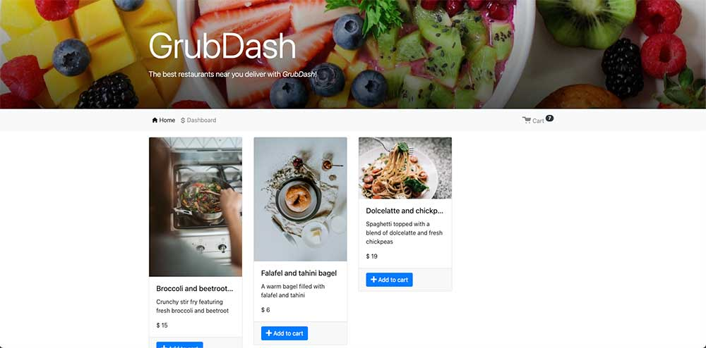

# Grub Dash Backend Project

I was tasked with setting up an API and building out specific routes so that the frontend developers can demo some initial design ideas for the big bosses at a fictional fast food startup called GrubDash. The GrubDash project tested my ability to build APIs with complex validation. In a nutshell, I wrote custom middleware functions, built APIs that followed RESTful design principles, accessed relevant information through route parameters and received r
equests through git routes.